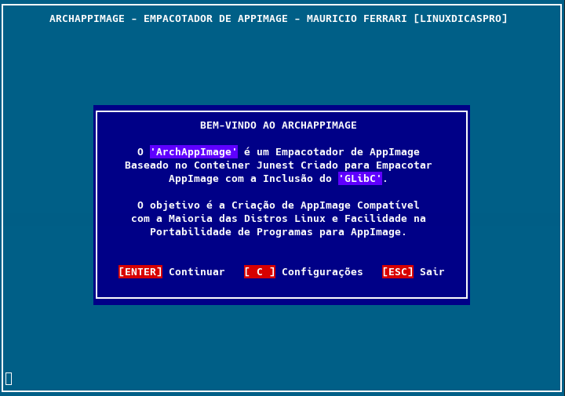
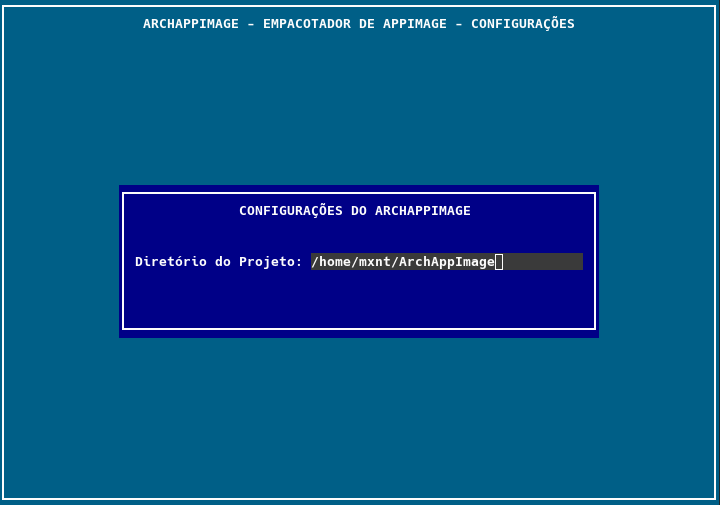
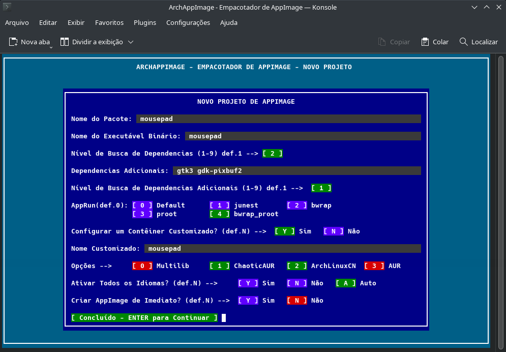

<p align="center">
  
</p>

<h1 align="center">ArchAppImage</h1>

<h3 align="center">
  Empacotador de AppImage Baseado no Projeto ArchImage que usa o
  Conteiner Junest para criar AppImage a partir de pacotes do Arch Linux.

</h3>

---

## 📜 Descrição

O **`ArchAppImage`** facilita o empacotamento de programas no no formato **`AppImage`** 
usando pacotes do Arch Linux. Ele automatiza a criação de pacotes e melhora a
compatibilidade com o sistema, além de contar com vários métodos de criação de AppImage e
inclusão do **`GLibC`**. Também é possível empacotar programas autocontidos em 
**`TarBall`** para quem optar por AppImages mais leves, porém com uma menor garantia
de funcionalidade, por não incluir o **`GLibC`**. 

## 🎯 Objetivo

O objetivo do **`ArchAppImage`** é oferecer uma solução simplificada para facilitar a
criação de **`AppImage`** em qualquer sistema usando vários métodos, principalmente via
contêiner, reduzindo a complexidade do processo e garantindo maior compatibilidade
entre vários sistemas Linux.

## 💡 Motivação

- O formato **`AppImage`** permite rodar aplicativos de forma portátil sem necessidade de
instalação. No entanto, a criação de AppImage pode ser trabalhosa. O método convencional
de empacotamento, pode exigir muitos testes em várias distros **`Linux`** para garantir o
máximo de compatibilidade possível. Portanto, é muito difícil garantir que o AppImage
vai funcionar na maioria das distros. 

- O método tradicional de criação de AppImage, sugere que você use um sistema mais
antigo para criar seus AppImages por conta do **`GLibC`**, o que faria com que fosse
necessário usar ou dedicar um ambiente **`oldstable`** separado do seu host ou uma VM
dedicada para a criação de Appimage.  

- Para cobrir o problema de compatibilidade com o **`GLibC`**, o mais recomendado é a
adição do próprio recurso ao AppImage, pois assim é possível usar o **`ld-linux`** para
abrir os programas.

- O projeto **`ArchImage`** é uma excelente ferramenta de criação de AppImage. Mas,
segundo meus testes, o desempenho e o modo como ele funcionava, não era satisfatório e
as vezes precisava esperar muito tempo ao repetir a criação do AppImage. Por isso,
eu decidi que eu queria uma solução extremamente rápida para criar AppImages sem precisar
esperar o AppImage empacotar de imediato para saber se o programa ia funcionar
perfeitamente após a criação do AppImage.

- A ideia de empacotar por **`Contêiner`** funciona bem, mas nem todos os programas
precisam ser empacotados dessa forma, então é necessário um modo de empacotamento que
criasse o AppImage, sem precisar de um contêiner para isso. 

- Soluções como **`bwrap`**, podem falhar em sistemas com restrições de **`namespaces`**
e não funcionarão. Uma solução é o **`proot`**, que é um pouco mais lento para iniciar
programas via conteiner, mas que é totalmente funcional. 

- Não é possível a execução do **`Junest`** usando superusuário. É preciso uma conta de
usuário comum para poder executar o AppImage. Distros modulares como o **`Puppy`**
costumam usar conta root por padrão, o que faz do AppImage baseado no Junest incompatível
com o sistema sem uma conta de usuário comum.

- Alguns programas podem precisar acessar o sistema **`host`** para poder realizar
alguma função no sistema. Eles podem acabar assumindo o contêiner como se fosse o host.

- Trabalhar com AppImage é uma forma de entender como o **`Sistema Linux`** funciona.

## ⛔️ Problemas do Método Tradicional de Criação de AppImage 

- Se o seu Sistema for muito desatualizado, você vai se deparar com um erro parecido
  com esse:
  ```bash
  /lib/x86_64-linux-gnu/libc.so.6: version `GLIBC_2.34' not found
  (required by /usr/lib/libstdc++.so.6)
  ```

- Não é possível garantir a adição de todas as dependências, uma vez que bibliotecas de
  baixo nível não costumam ser recomendadas para adição no AppImage.

- Ainda há programas que não foram pensados para serem portáteis e podem exigir acesso
  a caminhos absolutos em seus códigos.

- É difícil criar Appimages de programas desenvolvidos em **`Python`**.

## 🚀 Características e Recursos

- O Projeto conta com uma interface de linha de comando para a configuração mais básica.
Os ajustes mais refinados devem ser feitos normalmente no script de construção conforme
a necessidade.

- Várias opções de Scripts de Construção:

   - ✅ **`APP-ArchAppImage`** - usa contêiner junest.
   - ✅ **`APP-Tarball2AppImage`** - cria AppImage com pacotes em tarball.

- São vários tipos de **`AppRun`** disponíveis:

   - ✅ **`AppRun_bwrap`** - conteiner bwrap.
   - ✅ **`AppRun_bwrap_proot`** - conteiner bwrap com proot como fallbak.
   - ✅ **`AppRun_default`** - modo padrão, sem conteiner.
   - ✅ **`AppRun_junest`** - conteiner junest.
   - ✅ **`AppRun_proot`** - conteiner proot.
   - ✅ **`AppRun_tarball`** - para AppImage em tarball.

- Não há a necessidade de separar os projetos de **`AppImage`** em vários diretórios.
Pode ser usado o mesmo contêiner para empacotar vários AppImages diferentes,
economizando espaço em disco.

- Se for preciso, pode ser criado um conteiner só para uma aplicação específica da mesma 
forma que é feito no projeto do **`ArchImage`** e escolher se vai ser preciso uma dessas
opções para a construção do AppImage:

   - ✅ **`Mutilib`** - para programas que precisam de multilib.
   - ✅ **`ChaoticAUR`** - para programas do repositório do ChaoticAUR.
   - ✅ **`ArchLinuxCN`** - para programas do repositório do ArchLinuxCN.
   - ✅ **`AUR`** - para programas que serão compilados do repositório AUR.

- Possui resolução automática de dependências, podendo ser ajustado usando diferentes
níveis de busca por dependências.

- Em programas binários, pode ser habilitado uma busca por **`libs`**, que pode ajudar a
executar o programa usando menos níveis de busca por dependências, o que pode reduzir
o tamanho do AppImage.

- Você pode ativar a autointegração na área de trabalho e a autointegração de inicialização
durante a primeira execução do AppImage.

- Possui uma forma alternativa para configurar a detecção correta do idioma de forma
definitiva em caso de programas que não detectam o idioma de forma alguma.

- O método padrão conta com um método automático para resolver o cache do gdk-pixbuf2 para
ajudar na compatibilidade de programas que usam **`GTK`**.

## 🛠️ Instalação

Não há a necessidade de instalação, basta clonar o repositório e, se quiser, colocar em
algum local no sistema e linkar no **`/bin`** ou em algum local para ser adicionado na
variável **`PATH`**.

```bash
$ git clone https://github.com/LinuxDicasPro/ArchAppImage.git
$ cd ArchAppImage
$ sudo ln -s ArchAppImageGen /usr/bin/ArchAppImageGen
```

## 🖥️ Utilização Básica

1. A primeira coisa que você vai fazer, é abrir o utilitário via terminal:
   ```bash
   $ ArchAppImageGen
   ```
   Isso vai abrir uma ferramenta de configuração do script de construção do AppImage, que
   você pode configurar o local padrão do projeto pressionando **`C`** ou **`Enter`**
   para iniciar a configuração. Após a configuração, o script de construção será salvo
   no diretório padrão **`~/ArchAppImage`** ou no local que você configurou.

2. Depois você vai até o script gerado para a construção do AppImage no diretório do
   projeto que foi configurado, faça os ajustes e execute o script para criar o AppImage:
   ```bash
   $ cd ~/ArchAppImage
   $ kate package-ArchAppImage  # Faça os ajustes com o editor de sua preferência.
   $ ./package-ArchAppImage
   ```
   Se tudo der certo e o script estiver configurado corretamente, o AppImage será criado.

## ⚙️ Teste do AppImage

O **`RECOMENDADO`** é configurar o script para não criar o AppImage de imediato.
Assim, os testes serão feitos usando o AppRun. Entretanto, mesmo que o AppImage abra
corretamente, é sim necessário verificar seu funcionamento a procura de algum bug ou
alguma inconsistência. 

1. Execute o AppImage no terminal e verifique se não há nenhum erro durante a execução
   do programa:
   ```bash
   $ ./Sample-1.2.3-x86_64.AppImage
   ```

2. Para uma saída mais detalhada, use **`LD_DEBUG`**. Portanto, para procurar por
   **`libs`** faltantes, use:
   ```bash
   $ LD_DEBUG=libs ./Sample-1.2.3-x86_64.AppImage
   ```

3. Para ver os arquivos ausentes, use:
   ```bash
   $ LD_DEBUG=files ./Sample-1.2.3-x86_64.AppImage
   ```

   Para uma deparação mais aprimorada, consulte:  
   ​  ​  ​  ​ 🔹[The LD_DEBUG environment variable](https://www.bnikolic.co.uk/blog/linux-ld-debug.html)

## 📖 Documentação Completa

Para mais detalhes sobre o uso e as funcionalidades do **`ArchAppImage`**, projetos
incorporados e como solucionar problemas, consulte a documentação na wiki do github:

> 📜 [**Documentação Oficial do ArchAppImage**](https://github.com/LinuxDicasPro/ArchAppImage/wiki)

## 📷 Capturas de Tela

<p align="center">
    
  
  
</p>

## 📝 Próximas Implementações

- ✏️ Suporte a **`NVidia`** no modo de Conteiner.
- ✏️ Mais scripts alternativos de empacotamento.
- ✏️ Empacotamento usando **`sharun`**.
- ✏️ Ferramentas extras.
- ✏️ Possível implementação com debootstrap.
- ✏️ Reempacotador de AppImage para adição de modificações.
- ✏️ Possível ferramenta de autointegração.
- ✏️ Interface de desenvolvimento de Appimage.

## 🤝 Contribuindo

Contribuições são sempre **`Bem-Vindas!`** Se você deseja ajudar a melhorar este projeto,
siga as diretrizes abaixo para garantir um fluxo organizado e eficiente.

### 📌 Como contribuir

1. **Faça um fork do repositório**  
   - Clique no botão **`Fork`** para criar uma cópia do **`ArchAppImage`** na sua conta.

2. **Clone o repositório**  
   - No seu terminal, execute:
     ```bash
     git clone https://github.com/<seu-repositorio>/ArchAppImage.git
     cd ArchAppImage
     ```

3. **Crie um branch para sua modificação**  
   - Escolha um nome descritivo para o branch:
     ```bash
     git checkout -b my-contrib
     ```

4. **Faça as alterações e commit**  
   - Após editar os arquivos necessários, adicione suas mudanças:
     ```bash
     git add .
     git commit -m "description my contrib"
     ```

5. **Envie para o repositório remoto**  
   - Envie seu branch para o seu fork no GitHub:
     ```bash
     git push origin my-contrib
     ```

6. **Crie um Pull Request (PR)**  
   - Acesse o repositório original no GitHub e clique em **`New Pull Request`**.
   - Escolha o branch do seu fork e descreva suas alterações de forma clara.

### 📢 Dicas para um Pull Request bem-sucedido

- ✅ **Explique suas mudanças:** Escreva um título e uma descrição detalhada das alterações.  
- ✅ **Siga o padrão do código:** Mantenha a consistência do projeto.  
- ✅ **Faça commits pequenos e organizados:** Isso facilita a revisão.  
- ✅ **Revise seu código antes de enviar:** Evite bugs e erros desnecessários.  

Agradecemos sua contribuição! 🚀✨

## 📜 Licença

> Este projeto é distribuído sob os termos da **`GNU General Public License version 3`**.  
> Para mais detalhes sobre a licença, consulte o arquivo [**LICENSE**](LICENSE) ou acesse
> o texto completo da licença no site da **`Free Software Foundation`**:
> 
> 🔗 *https://www.gnu.org/licenses/gpl-3.0.html*

## 📩 Contato

- 📧 **Email**: *contatolinuxdicaspro@gmail.com*
- 💬 **Telegram:** [LinuxDicasPro](https://t.me/LinuxDicasPro)  
- ▶️ **YouTube:** [LinuxDicasPro](https://www.youtube.com/@LinuxDicasPro)  
- 👥 **Reddit:** [r/LinuxDicasPro](https://www.reddit.com/r/LinuxDicasPro/)
